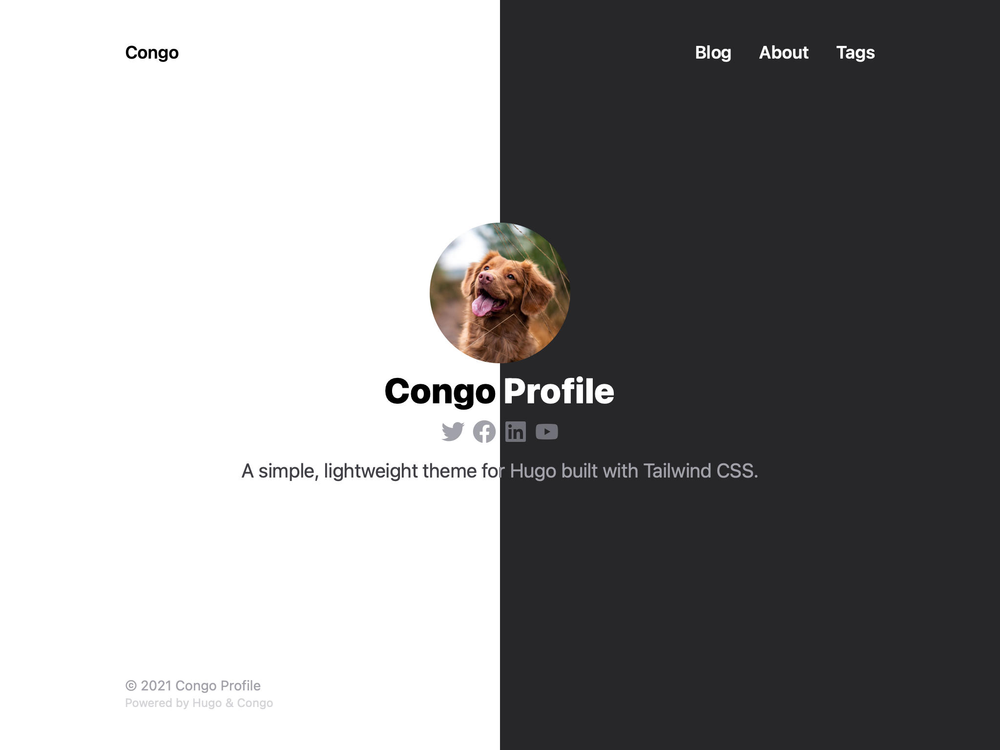

Congo 提供了完全灵活的首页布局。有两个主要的模板可供选择，并提供额外的设置以调整设计。此外，您还可以提供自己的模板，完全掌控首页内容。

首页的布局由`params.toml`配置文件中的 `homepage.layout` 设置控制。另外，所有布局都可以选择包含[最近的文章](#recent-articles)列表。

## Page布局

默认布局是page布局。它只是一个显示您的 Markdown 内容的普通内容页面。非常适用于静态网站，并提供了很大的灵活性。

要启用页面布局，请在 `params.toml` 配置文件中设置 `homepage.layout = "page"`。

## Profile布局

profile布局非常适用于个人网站和博客。它通过提供图像和社交媒体链接，将作者的详细信息置于中心位置。

作者信息存储在语言配置文件中。有关参数详细信息，请参阅 [入门指南]() 和 [语言配置]() 部分。

此外，提供在主页内容中的任何 Markdown 内容将显示在作者资料下方。这允许额外的灵活性，以使用 Shortcodes 显示生物或其他自定义内容。

要启用profile布局，请在 `params.toml` 配置文件中设置 `homepage.layout = "profile"`。

## custom布局

如果内置的首页布局不满足您的需求，您可以选择提供自己的自定义布局。这允许您完全掌控页面内容，基本上为您提供了一个空白的画布。

要启用自定义布局，请在 `params.toml` 配置文件中设置 `homepage.layout = "custom"`。

配置值设置后，创建一个新的 `custom.html` 文件并将其放置在 `layouts/partials/home/custom.html`。现在，`custom.html` 文件中的任何内容都将放置在站点首页的内容区域。您可以使用任何 HTML、Tailwind 或 Hugo 模板函数来定义布局。

要在自定义布局中包含[最近的文章](#recent-articles)，请使用 `recent-articles.html` 部分。

例如，这个站点的[首页]()使用自定义布局，允许在profile和page布局之间切换。访问 [GitHub 仓库](https://github.com/jpanther/congo/blob/dev/exampleSite/layouts/partials/home/custom.html) 查看它是如何工作的。

## 最近的文章

所有首页布局都可以选择在主页面内容下方显示最近的文章。要启用此功能，只需在 `params.toml` 配置文件中将 `homepage.showRecent` 设置为 `true`。

此部分中列出的文章来自 `mainSections` 设置，该设置允许使用您网站上使用的所有内容类型。例如，如果您有用于 _posts_ 和 _projects_ 的内容部分，可以将此设置设置为 `["posts", "projects"]`，所有这两个部分中的文章都将用于填充最近的列表。主题期望此设置为数组，因此如果您只使用一个部分来存储所有内容，您应相应地设置为 `["blog"]`。
